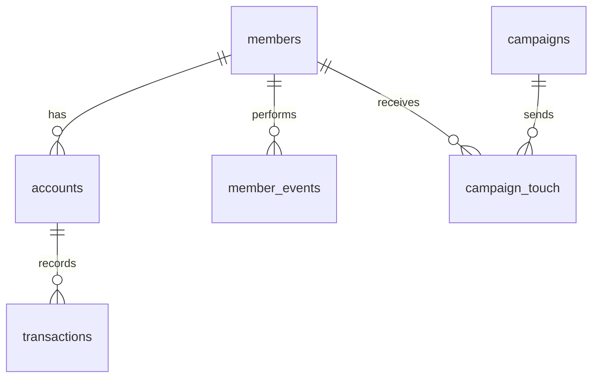

# 🏥 Healthcare Membership Growth Analytics  
### End-to-End SQL Membership, Marketing & Retention Analysis (SQL Server + Power BI Project)
---

## 🧭 Overview

This project simulates the **data analytics workflow of a Healthcare Membership & Growth Strategy team** — analyzing lead acquisition, funnel performance, member conversions, engagement patterns, and renewal behavior using **SQL Server** and **Power BI**.

It demonstrates a complete **end-to-end growth analytics pipeline**, from raw CSV ingestion to engineered SQL views, KPI development, business insights, and final dashboard delivery.

The dataset reflects a realistic **healthcare association CRM environment**, similar to how membership organizations operate when tracking lead quality, campaign impact, member engagement, and renewal outcomes.

---
<p align="center">
  
  
  
  
  
</p>

---

## 🚀 Quickstart

Clone the repo and open SQL Server Management Studio (SSMS) from the project root:

1. Create a new database:

```sql
CREATE DATABASE healthcare_growth;
GO
---


## 🧭 Mini ERD (Schema Overview)




